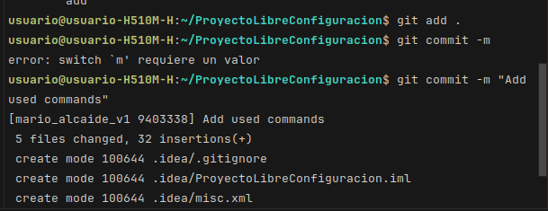

# Práctica de comandos de Git
#### Libre configuración - Guillermo Bárcenas López, Francisco Mejías de Matos, Mario Alcaide Perez y Felipe Alonso Fernandez  

---
Esta pratica tiene como fin poder aplicar Git a nuestros proyectos, practicaremos los comandos básicos como add, commit, push y algunos mas avanzados como Merge 

---
##### Índice
- **Creación de una rama** 
- **Commit Inicial** 
- **Conflicto entre la web y local** 
- **Uso de Merge** 
- **Uso de Stash y Amend** 
- **Uso de Revert** 
- **Uso de Cherry Pick** 
- **Creación de Pull-Request** 
- **Listado y borrado de Ramas** 
- **Conclusiones**
---
1. **Creación de una rama**  
Partimos de un repositorio público que hemos compartido todos los integrantes del grupo para poder operar sobre él. En el primer paso cada integrante deberá clonar el repositorio usando este comando.  
   ~~~
   git clone https://github.com/guillermo20052009/ProyectoLibreConfiguracion
   ~~~
  

Tras clonar el repositorio cada integrante del grupo creará un rama con el siguiente formato <nombre_apellidos_v1> para trabajar sobre ella.  
  ~~~
  git checkout -b <nombre_apellidos_v1>
  ~~~
  

[Enlace al diagrama](https://drive.google.com/file/d/1OGA-V4_20N8UnIGlXNveywVdCZCEsaSm/view?usp=sharing) 
